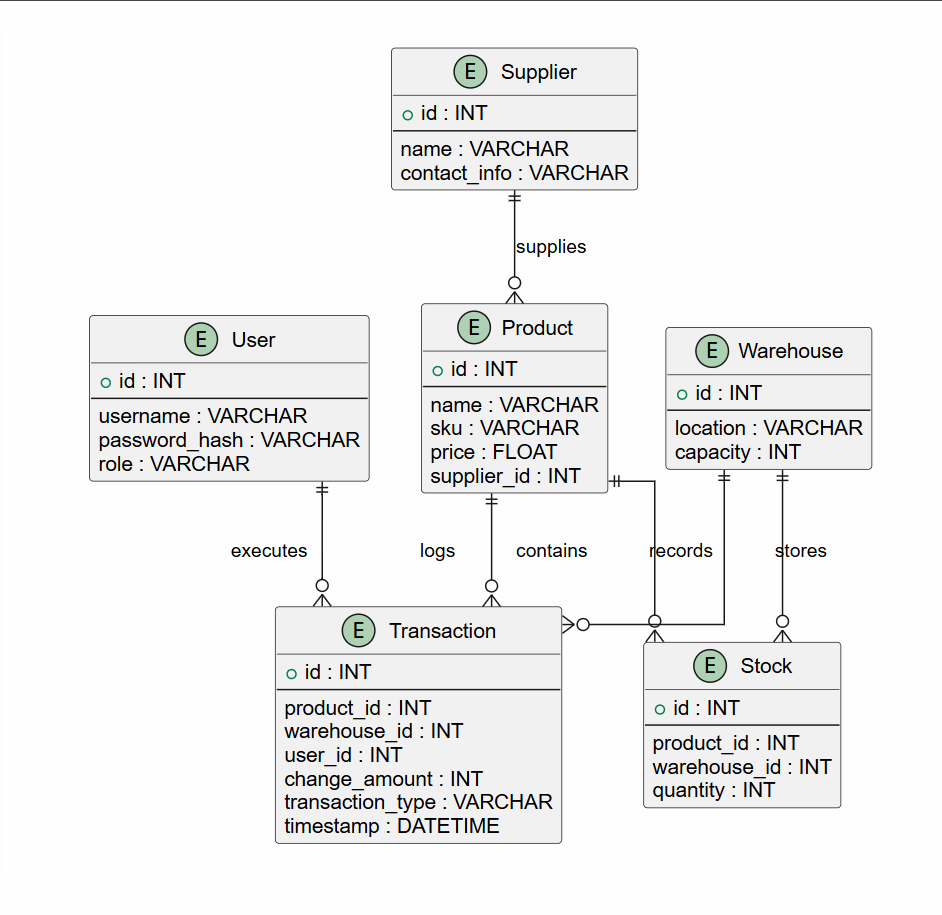
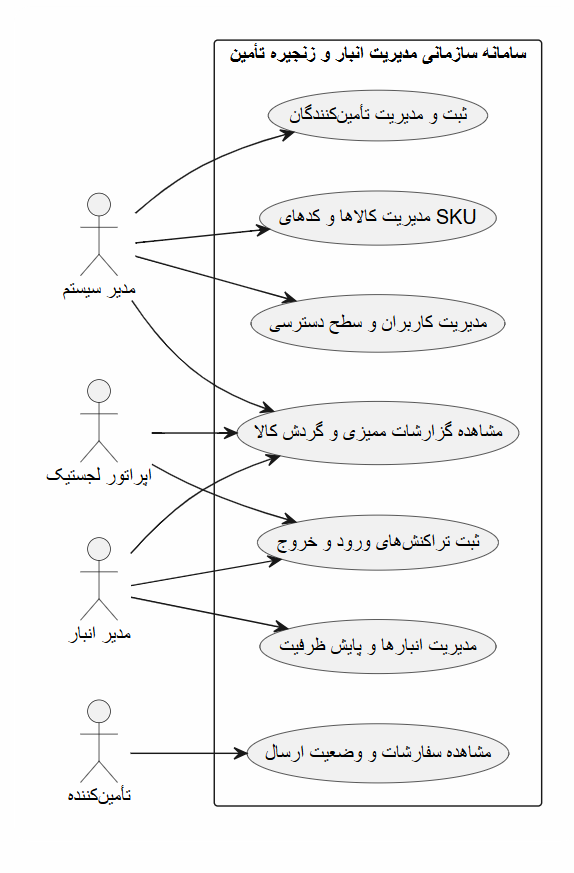

# Enterprise Supply Chain and Warehouse Management System

An advanced, enterprise-grade web application built with Python (Flask) and SQLAlchemy for real-time inventory tracking, multi-warehouse operations management, and secure role-based access control.

---

## Features and Modules
- **Role-Based Access Control (RBAC):** Secure management for Administrators, Warehouse Managers, Logistics Operators, and Suppliers.
- **Real-Time Inventory Tracking:** Automated stock adjustments coupled with immutable transaction auditing logs.
- **Multi-Warehouse Management:** Spatial capacity monitoring, threshold warnings, and location-based stock allocation.
- **Advanced Audit Trails:** Comprehensive database logging for every inbound and outbound supply chain movement.

---

## Tech Stack
- **Backend:** Python, Flask, Flask-SQLAlchemy
- **Database:** SQLite (Relational Enterprise Schema)
- **Documentation:** PlantUML (Architecture and Use Case Modeling)

---

## System Architecture and Diagrams

### 1. Entity-Relationship Diagram (ERD)
The database schema handles relational integrity across Users, Suppliers, Warehouses, Products, Stocks, and Transactions:



### 2. Use Case Diagram
System interaction mapping across different administrative and operational actors:



---

## Installation and Setup

1. Clone the repository:
   ```bash
   git clone [https://github.com/soroshTypeG/supply-chain-management-system.git](https://github.com/soroshTypeG/supply-chain-management-system.git)
   cd supply-chain-management-system
    

**Install dependencies:**

```bash
pip install -r requirements.txt
```

**Run the application:**
```bash
python app.py
   
